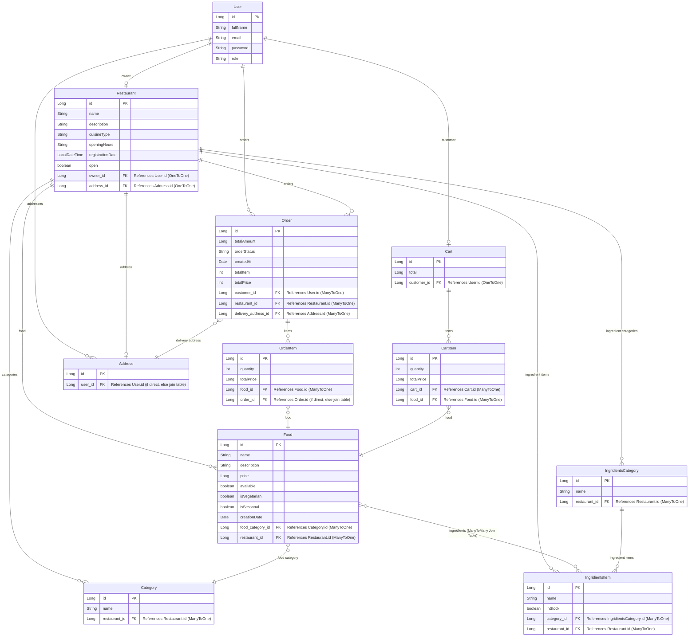

# Online-Food-Ordering ER Diagram

This ER diagram illustrates the database schema and relationships based on the JPA entities in your `Online-Food-Ordering` project. It specifically highlights the foreign keys used to link tables.

> [!NOTE]
> Some collections annotated with `@ElementCollection` (like `images` or `favorites`) will create separate mapping tables in the database, but they are omitted as standalone entities here for clarity, focusing on the main entity relationships. Many-to-Many relationships also typically create join tables.

